# SuperAKS-App
In this repo, you will learn about some of the AKS features that make it easier for developers to deploy that code without having to worry too much about infrastructure. Begin by cloning the repository.
> :warning: You will need to fork this repo and clone your fork in order to complete the steps requiring updating the GitHub(GH) repository and using GH Actions for deployment. I recommend you do this and clone **your** repo instead of the repo used in the command below.

```bash
git clone --recurse-submodules https://github.com/mosabami/SuperAKS-App
cd SuperAKS-App
```
In this workshop, you are a developer who created an app that calculates fibonacci number of indexes. You have written the code and would love to deploy it online. You have chosen to deploy it to a k8s cluster. You have heard AKS is the best place for kubernetes. You decide to try it out yourself.

AKS has a lot of amazing features that makes software development and delivery very easy. It takes care of a lot of the infrastructure security related heavy lifting for you. In this workshop we will discuss the following features of AKS:
* Bicep IaC to make it easier and quicker to deploy AKS and its supporting resources in a reproducible way
* Azure AD for authentication so you don't have to manage that yourself
* Azure RBAC integration with AKS for authorization
* Azure Key vault integration and the CSI driver for easy secrets management
* AKS persistent volume & persistent volume claim provisioning Azure file resources dynamically
* Bridge to Kubernetes which allows you to test & debug individual microservices against other services already running on AKS
* Developer tools for AKS and the Draft tool to automatically create Kubernetes manifest files
* Automated Deployments feature on AKS to automatically create GitHub Action pipelines and provide federated identity to the repo so that it can be used to deploy changes to AKS
* Azure container registry integration for storage in a High availability registry as well as image security
* AKS workload identity (preview) which makes it easy to assign identities to individual pods in your cluster for better security. It can be integrated with various identity providers 
* AKS CNI overlay (preview) so you don't have to worry about pod IP exhaustion
* Horizontal pod autoscaler
* Cluster autoscaler for easy and quick scaling of your application
* Azure load testing (preview) to test scalability of your application

If there are other AKS features you'd like to see here that help with developer productivity, please create an issue. PRs are also welcome!

## Prerequisites
It is assumed you have basic knowledge of Containers, Kubernetes and Azure. You would also require Contributor and User Access Admin access to an Azure subscription and an AAD tenant where you have User Admin access. On your computer you will need to have the following installed
* git, 
* [Bicep](https://learn.microsoft.com/en-us/azure/azure-resource-manager/bicep/install)
* [jq](https://stedolan.github.io/jq/download/)
* [Kubectl](https://kubernetes.io/docs/tasks/tools/install-kubectl-windows/)
* [sed](https://gnuwin32.sourceforge.net/packages/sed.htm) (optional)
* [node and npm](https://nodejs.org/en/download/) for the Bridge to Kubernetes step
* Azure CLI

Docker desktop would be required for some optional steps. All commands are designed to run on bash terminals.
You will also require visual studio code with the following extensions installed for some **optional** steps: 
* Azure Kubernetes Service
* Azure tools
* Bridge to Kubernetes
* Developer Tools for Azure Kubernetes Service. 

You can install these by searching for them in the Extensions tab.

## Test the app on your computer (optional)
If you have docker desktop install and started on your computer, and you have some experience with docker-compose you can run the application on your local computer. 
Introduce a bug in the code so that we can correct it later
> :warning: If you are using a mac you will need to change the command to `sed -i  "s/Sign In/Signing In/" smartbrain/smartbrain/smartbrainclient/src/components/Signin/Signin.js`. 

> :bulb: If these sed commands don't work for any reason or if you don't have sed installed, you will need to update these files manually by replacing the placeholders in the files mentioned below.
```bash
sed -i  "s/Sign In/Signing In/" smartbrain/smartbrain/smartbrainclient/src/components/Signin/Signin.js
```
Run the application using docker-compose.
```bash
cd smartbrain/smartbrain
docker-compose up
```
You can access the website at port 3050 on your local computer using NGINX as an ingress controller. Check out the docker-compose.yaml file for more details.
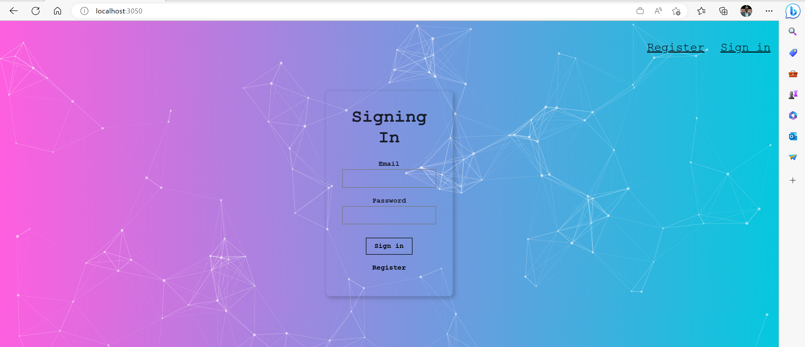
You can test the app by clicking on register and providing the required information. 

> :bulb: You might find that there is a bug in the spelling of Password. This bug will be fixed in the **Testing & Debugging individual microservices using Bridge to Kubernetes** section of the workshop.

Here is what the architecture of the app looks like
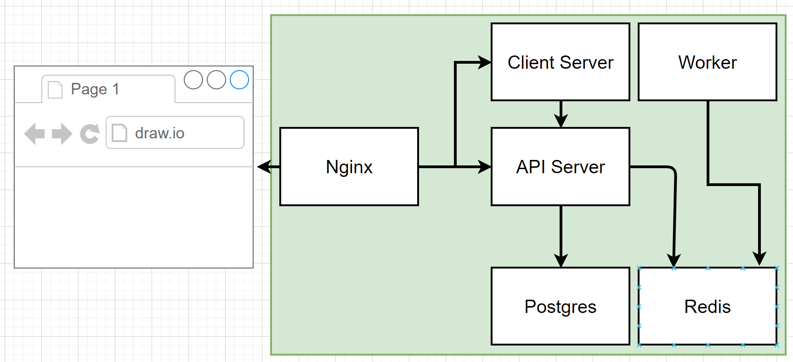
* The Client Server is a React app that renders the front end of the app on a browser
* The API server receives requests from the front end and updates the database with the requested information. It stores a placeholder as the value of the index requested by the front end and stores it in redis
* The worker listens to redis and whenever there is a new entry by the API server, it takes the index, calculates the fibonacci number and replaces the placeholder by the correct value. It can also be accessed directly just for the purpose of testing the bridge to kubernetes feature.
* Redis microservice runs a redis instance and has a persistent volume claim when deployed to Azure
* Postgres microservice runs a postgres instance that is currently not persisted. To be replaced by a Azure postgres database in the future

CD out of the fib-calculator folder.
```bash
cd ..
```

## About the infrastructure
Now that we have seen the app running locally, it is time to deploy it to AKS. There are preview features being used including [workload identity](https://learn.microsoft.com/en-us/azure/aks/workload-identity-deploy-cluster#register-the-enableworkloadidentitypreview-feature-flag) and [CNI overlay](https://learn.microsoft.com/en-us/azure/aks/azure-cni-overlay#register-the-azureoverlaypreview-feature-flag). You will need to ensure these features are enabled in your subscription before proceeding with the deployment.

### About AKS Landing Zone Accelerator (AKS-LZA)
[AKS Construction (AKSC)](https://github.com/Azure/Aks-Construction#getting-started) is part of the [AKS landing zone accelerator](https://aka.ms/akslza/referenceimplementation) program and allows rapid development and deployment of secure AKS clusters and its supporting resources using IaC (mostly Bicep), Azure CLI and/or GitHub Actions. AKS Landing Zone Accelerator is a set of tools, resources and guidance that helps deploy and operationalize secure and scalable AKS and supporting services rapidly, AKS Construction helper being one of them. Check out the [official docs](https://learn.microsoft.com/en-us/azure/cloud-adoption-framework/scenarios/app-platform/aks/landing-zone-accelerator) for more information.
> :warning: It is very important to note that the AKS-LZA can be used to develop secure and compliant AKS clusters that are (almost) ready for production. However, many of the best practice guidance are not used in this implementation to facilitate easy learning and deployment in this workshop. **Do not use this configuration for production workloads**. To deploy a more secure environment, consider reading the AKS-LZA docs and/or deploy your environment using a configuration [similar to this](https://azure.github.io/AKS-Construction/?preset=entScaleOps&entscale=online&cluster.AksPaidSkuForSLA=true&cluster.SystemPoolType=Standard&cluster.upgradeChannel=rapid&net.cniDynamicIpAllocation=true&net.maxPods=250&net.podCidr=10.240.100.0%2F24&net.bastion=true&net.azureFirewallsSku=Premium). 

You will need to clone the AKSC repository which has the bicep files our deployment depends on into the IaC folder.
```bash
cd IaC
git clone https://github.com/Azure/AKS-Construction
```

## Deployment
Get the signed in user id so that you can get admin access to the cluster you create
```bash
SIGNEDINUSER=$(az ad signed-in-user show --query id --out tsv)
RGNAME=superapp
```

Create deployment
```bash
az group create -n $RGNAME -l EastUs
DEP=$(az deployment group create -g $RGNAME  --parameters signedinuser=$SIGNEDINUSER  -f main.bicep -o json)
```
> :bulb: The DEP variable is very important and will be used in subsequent steps. You can save it by running `echo $DEP > test.json` and restore it by running `export DEP=$(cat test.json)`

Get required variables
```bash
KVNAME=$(echo $DEP | jq -r '.properties.outputs.kvAppName.value')
OIDCISSUERURL=$(echo $DEP | jq -r '.properties.outputs.aksOidcIssuerUrl.value')
AKSCLUSTER=$(echo $DEP | jq -r '.properties.outputs.aksClusterName.value')
SUPERAPPID=$(echo $DEP | jq -r '.properties.outputs.idsuperappClientId.value')
TENANTID=$(az account show --query tenantId -o tsv)
ACRNAME=$(az acr list -g $RGNAME --query [0].name  -o tsv)
```

Log into AKS and deploy NGINX ingress. Since we are using 
```bash
az aks get-credentials -n $AKSCLUSTER -g $RGNAME --overwrite-existing
kubectl get nodes

curl -sL https://github.com/Azure/AKS-Construction/releases/download/0.9.6/postdeploy.sh  | bash -s -- -r https://github.com/Azure/AKS-Construction/releases/download/0.9.6 \
	-p ingress=nginx
```

Create the superapp namespace that will be required for future steps
```bash
kubectl create namespace superapp 
```

cd out of IaC folder
```bash
cd ..
```

## Building the images
We will build images from source code and pull database images from Dockerhub. We will store these images in our container registry to stay in compliance with our policy to only use images in approved registry

Build front end image
```bash
cd fib-calculator/client
az acr build -t client:v1 -r $ACRNAME --resource-group $RGNAME .
```

Build api image
```bash
cd ../server
az acr build -t server:v1 -r $ACRNAME --resource-group $RGNAME .
```

Build fib calculator image
```bash
cd ../worker
az acr build -t worker:v1 -r $ACRNAME --resource-group $RGNAME .
```
Import redis and postgres images from Dockerhub
```bash
az acr import --name $ACRNAME --source docker.io/library/redis:latest --resource-group $RGNAME
az acr import --name $ACRNAME  --source docker.io/library/postgres:latest --resource-group $RGNAME
```

Verify that the 5 required images are in the container registry
```bash
az acr repository list --name $ACRNAME --resource-group $RGNAME
```

### Use the Draft tool to automatically create Kubernetes Manifest Files (Optional)
Draft is a tool that makes it easy to develop resources required to deploy applications to kubernetes. This includes the creation of Docker files, Kubernetes manifest files, Helm charts, Kustomize files, GitHub Action pipelines, etc. In this section, we will be showcasing the use of Draft to crete Kubernetes manifest files to speed up the creation of resources required to deploy to kubernetes using the Developer Tools for Azure Kubernetes Service extension. You can also do this using the Draft CLI. For more information about the features of this extension, check out [this video](https://microsofteur-my.sharepoint.com/personal/asabbour_microsoft_com/_layouts/15/stream.aspx?id=%2Fpersonal%2Fasabbour%5Fmicrosoft%5Fcom%2FDocuments%2FWork%2FFY23%20%2D%20PM%2FDevX%2FDevX%20Demo%2Emp4&ct=1673905797417&or=Teams-HL&ga=1) that walks you through it later if you are a Microsoft employee or check out the [demo repo](https://github.com/sabbour/contoso-names) otherwise. 
> :warning: For the Draft and Developer Tools for AKS extension to work properly, you need to ensure your file path is not too long. Make sure you are working off a folder that doesn't have a long file path.

> :bulb: At this point, you might want to switch to a different branch so that the changes you are about to make to the files don't carry on to your main branch allowing you to rerun this workshop in the future easily: `git checkout -b test`

1. Expand the fib-calculator folder
1. Right click on the "worker" folder on the left side of the screen in your repo within vs-code. Hover over "Run AKS DevX Tool" then click on "AKS Developer: Draft a Kubernetes Deployment and Service
    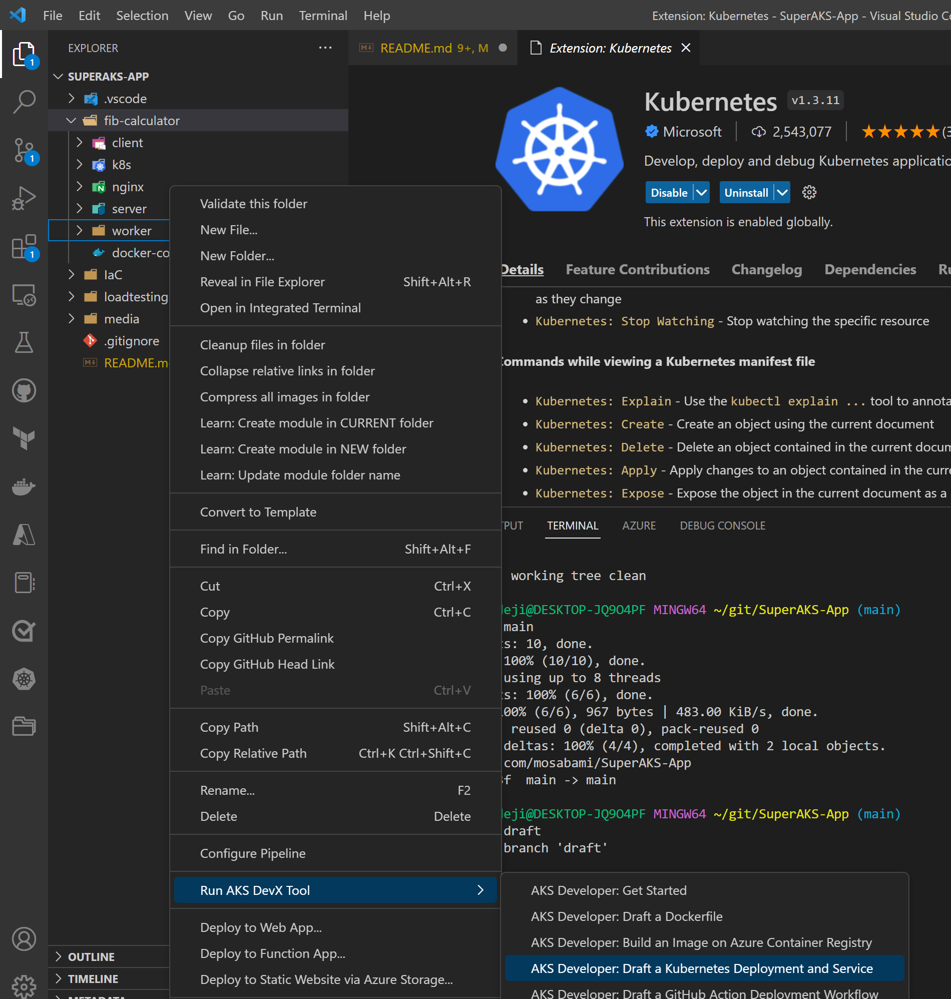
1. Choose the folder you want your manifest files to be saved in. In this case we will choose the fib-calculator folder which in which the worker folder is
1. Click on "Manifests" in the resulting prompt
1. Enter the application name, in this case it will be "superapp-worker" and hit enter
1. Enter port "5001" and hit enter
1. Choose the superapp namespace. This tool has used other extensions to connect to the k8s cluster and identify the available namespaces
1. Choose Azure Container Registry 
1. Choose your Subscription where your cACR subscription is
1. Choose the Resource Group where your ACR resides
1. Choose your ACR
1. Select your worker registry
1. Select the v1 tag

AKS DevX tool will automatically create a draft of deployment and service manifest files ready for you to modify to suit your needs within the manifests folder in the folder you selected as your output folder. These files can then be updated to include required environment variables, specify resources and limits, proper labeling for deployment and service selectors, etc. For the rest of this workshop however we will use the manifest files already provided in the k8s folder in the fib-calculator folder.

### Deploy required resources

Change the deployment files to use the proper container registry names using sed commands. 
> :warning: If you are using a mac you will need to change the command to `sed -i '' "s/<ACR name>/$ACRNAME/" client-deployment.yaml`. 

> :bulb: If these sed commands don't work for any reason or if you don't have sed installed, you will need to update these files manually by replacing the placeholders in the files mentioned below.
```bash
cd ../k8s
sed -i  "s/<ACR name>/$ACRNAME/" client-deployment.yaml
sed -i  "s/<ACR name>/$ACRNAME/" postgres-deployment.yaml
sed -i  "s/<ACR name>/$ACRNAME/" redis-deployment.yaml
sed -i  "s/<ACR name>/$ACRNAME/" server-deployment.yaml
sed -i  "s/<ACR name>/$ACRNAME/" worker-deployment.yaml
```
Update the secret provider class file
```bash
sed -i  "s/<identity clientID>/$SUPERAPPID/" secret-provider-class.yaml
sed -i  "s/<kv name>/$KVNAME/" secret-provider-class.yaml
sed -i  "s/<tenant ID>/$TENANTID/" secret-provider-class.yaml
```

Update the service account files. These service accounts are using workload identity federated identity.
```bash
sed -i  "s/<identity clientID>/$SUPERAPPID/" svc-accounts.yaml
sed -i  "s/<tenant ID>/$TENANTID/" svc-accounts.yaml
```

Deploy the resources into the superapp namespace.
```bash
kubectl apply -f .
```
> :warning: Depending on the order in which the manifest files are deployed, some pods may not connect and so you might have to redeploy by deleting the specific deployments not working and reapplying.

```bash
kubectl delete -f server-deployment.yaml  && kubectl apply -f server-deployment.yaml 
```

So what have we done here? We are using workload identities. Workload identities is a soon to be released AKS feature that allows you to use any of various identity providers as the identity of your pod. In this case we are using Azure AD as the identity provider and using the AKS cluster as the OIDC issuer. You can use other identity providers as well. This identity will only be assigned to the pods that are using the service account attached to the identity. This way other pods within the same node wont have the same access. This is important for securing your workloads by providing minimum access. In this case, we are using the identity to get access to the Azure Keyvault. Only this identity and consequently the pods configured to use the identity will be able to pull secrets from it and get the postgres database password. Check out the postgres and server deployment yaml files as well as the svc accounts and secret provider class yaml files for more details.

But how was the workload identity deployed? Check the resources towards the end of the main.bicep file in the IaC folder as well as the workloadid.bicep file. The kvrbac.bicep file shows how the workload identity was granted access to keyvault to pull secrets as well as how the postgres password was created.

### Test your running application
You can now access your application on a web browser (or postman) using the nginx ingress controller you deployed. You will need the ip address of the ingress controller's service.
```bash
kubectl get ingress -n superapp
```
You should be able use the ip address as shown in the screenshot below. You can test the app by entering a number under 40, clicking submit and refreshing the page.
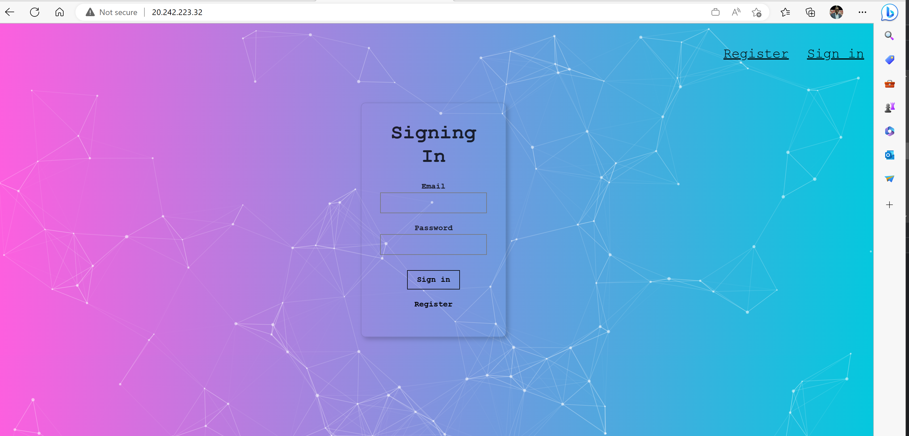
> :bulb: You might find that there is a bug in the fibonacci number calculation. This bug will be fixed in the **Testing & Debugging individual microservices using Bridge to Kubernetes** section of the workshop.

## Monitoring Scalability testing
AKS makes it easy to monitor your applications using various tools including Prometheus, Grafana, and Azure monitor. In this workshop, we will be using container insights.

We tested the app using a single user accessing it using the website. But how do we ensure our application will hold when there are hundreds or thousands of users using it at once? We will use Azure load testing (preview) using a JMeter test script to test this. We will see if our cluster scales and learn how easy it is to enable scaling. For more general information about this check out the [Scalability scenario on AKS-LZA](https://github.com/Azure/AKS-Landing-Zone-Accelerator/tree/main/Scenarios/Testing-Scalability)

Open Azure portal in two tabs. In the first one, navigate to container insights to see the usage of your cluster. 
AKS resource -> Insights (in the left blade under monitoring) -> "Containers" tab (the containers tab is found in the top middle of the page) -> Time range (which can be found at the top left no in the blade) -> last 30 minutes -> Apply

Here you should be able to see the usage of the pods over the last 30 minutes. 
Filter to only show pods in your node pool. "Add filter" -> Namespace -> superapp

1. On the second Azure portal tab, create a new Azure load testing resource within the same resource group as your AKS cluster. 
1. Click on "Go to resource" and click "Create" under Upload a JMeter script
1. Enter an appropriate test name and hit Next at the bottom
1. Click on the folder close to the "Choose files" field, then navigate to folder where you cloned the repo (AKS-Superapp). Under that open the load testing folder and choose the "test-superapp.jmx" file.
1. IMPORTANT: Click on the "Upload" button, then click Next
1. You will need to enter some parameters. You can enter them as shown in the picture below:
   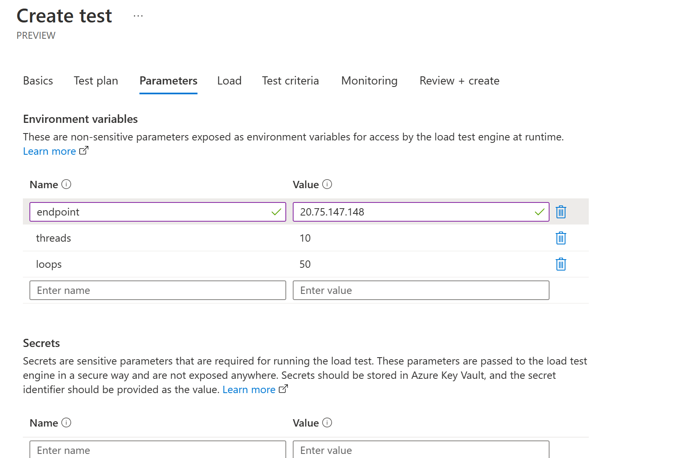
1. Move forward to the monitor tab and add the AKS cluster running the app
1. Click "Review and Create" then click "Create"
1. Watch Azure load testing run the test you should be able to see something similar to below indicating that none of the requests failed
   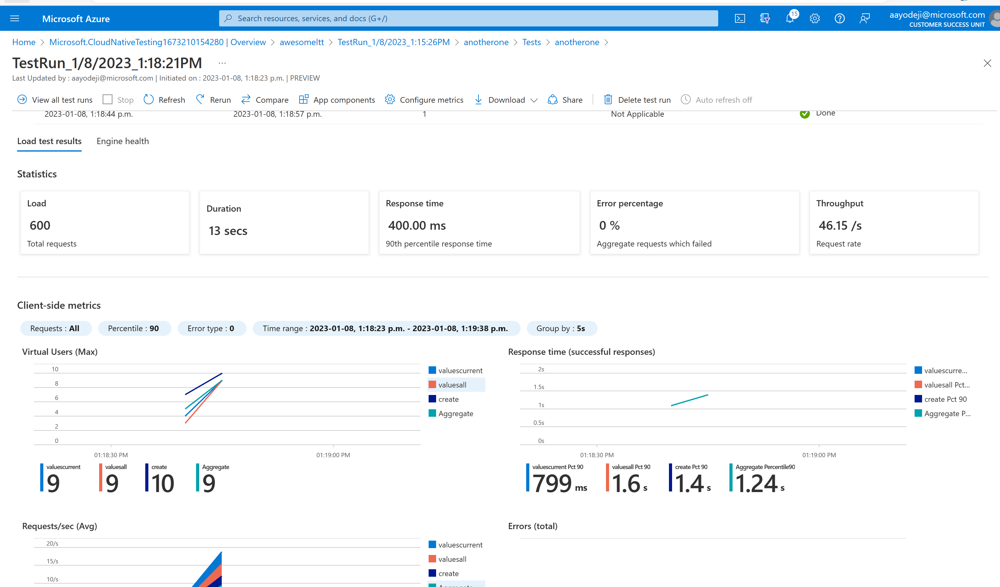
Heading over to the monitoring tab however you can see that the worker pod was heavily utilized. 
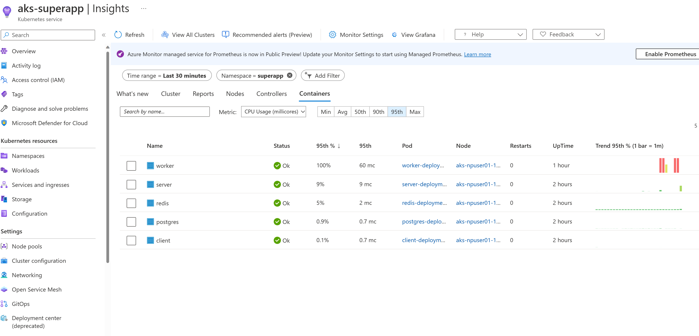
The worker pod is the service that calculates the fibonacci number. When the /api/values endpoint gets hit, the API updates redis with the new value in the body of the request. The worker pod, which is subscribed to redis is listening and runs the calculation whenever redis is updated (even if the same number is given repeatedly). It is decoupled form the api pod which is why there was no failure there even though the worker pod was backed up. This means the worker pod was unable to run some of the calculations.

Heading back and refreshing the application in the browser will show that many entries have been entered into the postgres database during the run by the server microservice under "Indexes I have seen". We see lots of "32" because that is the value given in the request body if the /api/values post request. You can inspect the jmx file for more details.

### Adding a horizontal pod autoscaler 
To help the worker pod with the calculations, we will deploy a horizontal pod autoscaler for the worker deployment. cd to the ./loadtesting folder and deploy the horizontal pod autoscaler. Watch the pods to see if there are any new ones being created as we run the load test again
```bash
cd loadtesting
kubectl apply -f worker-hpa.yaml
kubectl get pods -n superapp -w
```
Head back to the load test tab and rerun the test by clicking on the "Rerun" button in the results page.
After a minute or so, after the test is completed, you will find that some new pods have been created but many of them are sitting in pending state
```bash
kubectl get pods -n superapp 
```
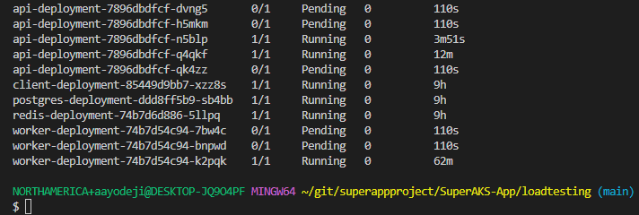
Heading over to Azure monitor will show that the worker pods that were able to be scheduled are all fully utilized
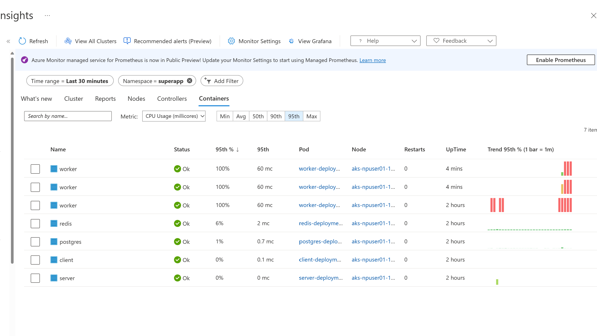
And this is happening in spite of the fact that the node itself is not fully utilized as showed in the nodes tab
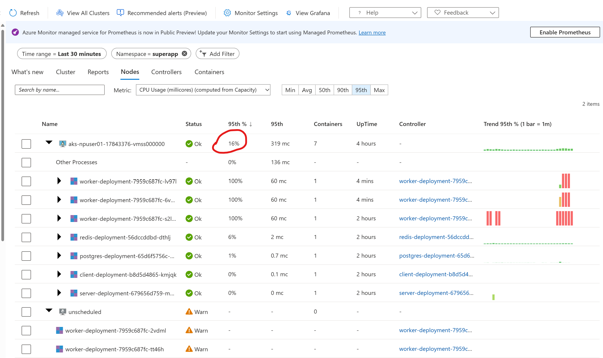
This is happening because the total requests of all the scheduled pods has reached the available cpu available in the node even though the requested CPUs are not being fully utilized by all the pods in the node. To avoid this, set your requests numbers in your deployment manifest files to a lower number. For the sake of this demo however, we will leave it as is.

### Adding scalability to your cluster with Cluster Autoscaler
To allow more worker pods to be scheduled, we will enable Cluster Autoscaler. Cluster autoscaler is an AKS feature that allows the k8s control plane create new nodes and add them to the cluster node pool so that your application can scale automatically without having to worry about that. Run the command below the enable cluster autoscaler. You can also enable it at the time of cluster creation or by updating the bicep deployment scripts and rerunning it.

1. Run the following command to change the default cluster autoscaler profile (default values can be found in the AKS Cluster REST API documentation). These parameters enable a rather aggressive scale-down to avoid longer waiting times in this tutorial. Please be mindful when setting these values in your own cluster.
    ```azurecli
    az aks update \
        --resource-group $RGNAME \
        --name $AKSCLUSTER \
        --cluster-autoscaler-profile \
        scale-down-unneeded-time=2m \
        scale-down-utilization-threshold=0.8
    ```
1. Enable autoscaling between a number of 1 and 5 nodes on your npuser01 node pool :
    ```azurecli
	az aks nodepool update \
      --resource-group $RGNAME \
      --cluster-name $AKSCLUSTER \
      --name npuser01 \
      --enable-cluster-autoscaler \
      --min-count 1 \
      --max-count 5
	```
Rerun the test again to see pods scheduled to help with the load but this time, let us increase the load. In the test run result screen click on "View all test runs" in the top right corner. Then click on "Configure" -> "Test", then head over to the "Parameters" tab. Update the **threads** to 50 and **loops** to 250. Click "Apply" at the bottom left. This will take you to your tests screen. Click on the test you just modified, and click "Run" at the top of the resulting page, then click "Run" to run the test. Click "Refresh" at the top left side of the screen then click on the run you just executed.

You will find that the test completed successfully. Entering kubectl get pods -n superapp after a minute will show pods in the pending state. Wait a couple of minutes and you will see a new node created.
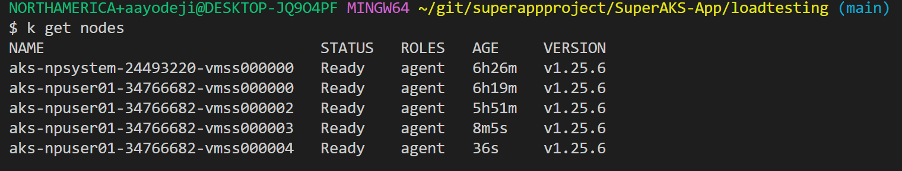
Check to see which pods are in the new node.
```bash
kubectl get pods -n superapp -o wide
```
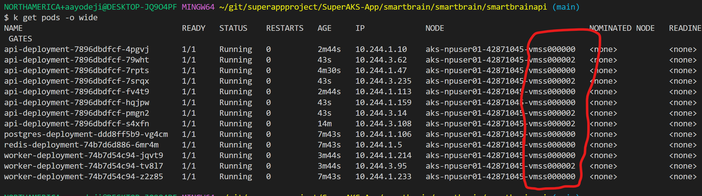
After a couple of minutes, heading over to the "Nodes" tab of Azure monitor shows the new node and its utilization.
Lets test it again but this time with threads set to 300 and loops set to 450. You can also update the loadtesting/worker-hpa.yaml and server-hpa.yaml files to increase the `maxReplicas` numbers.

This exercise shows one of the advantages of containers and kubernetes. You can optimize the utilization of your nodes (virtual machines) and scale various components of your application independently to increase and decrease based on the demand on that particular service. With AKS CNI overlay, you don't have to worry about IP exhaustion. The overlay network takes care of that for you. You can have max 250 pods in each node with CNI overlay and those IP addresses will be from a different IP space than your node (and virtual network).

## Testing & Debugging individual microservices using Bridge to Kubernetes
Bridge to kubernetes is an amazing tool that allows developers debug and test their code by running their Microservice locally on their computer and having it connect to other microservices running in their kubernetes cluster. This way, they can test changes they make to their local microservice against the entire application already running on kubernetes. For more information about this, check out [this video](https://www.youtube.com/watch?v=yl14NJcUMGU).
For Bridge to work, you need to be able to run the application locally. We begin by installing the packages required to run the worker node express microservice locally.

> :warning: To begin you might have to set the context of kubeconfig to use the superapp namespace in order for bridge to kubernetes to work properly. You would also want to delete the worker hpa and redeploy the worker deployment.

```bash
kubectl config set-context --current --namespace=superapp
```
```bash
kubectl delete -f worker-hpa.yaml
```
```bash
cd ../fib-calculator/k8s
kubectl delete -f worker-deployment.yaml && kubectl apply -f worker-deployment.yaml
```

1. CD to the directory that has your worker server code
    ```bash
    cd fib-calculator/worker
    ```
1. Install the required packages
    ```bash
    npm install
    ```
1. Open the command pallet (you can do this by shortcut ctrl + shift + p)
1. Type "bridge" and select "Bridge to Kubernetes: Configure"
1. Select the "worker-cluster-ip-service" service
1. Enter "5000" as the port
1. Select "Configure Bridge to Kubernetes without a launch configuration"
1. Select "No" since you are the only one working on this application. You should see a notification similar to below stating your configuration was successful. 
1. Click on the "Kubernetes" status bar menu
    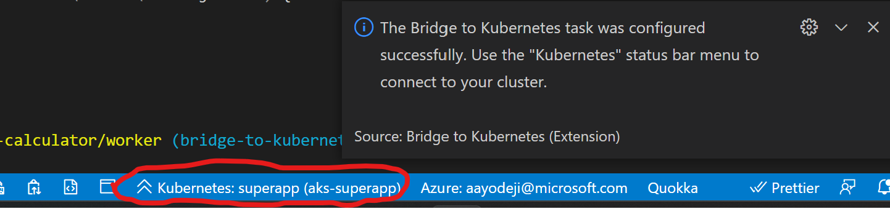
1. Click on the "Connect to the cluster" button that pops up at the top of the screen and wait for the connection to be established
1. When you see the pop-up, click on "Continue" and then "Yes" to provide Bridge to kubernetes the required permission
1. Once the connection is complete, take note of the host address of the redis-cluster-ip-service. You might need it if you have service discovery issues
    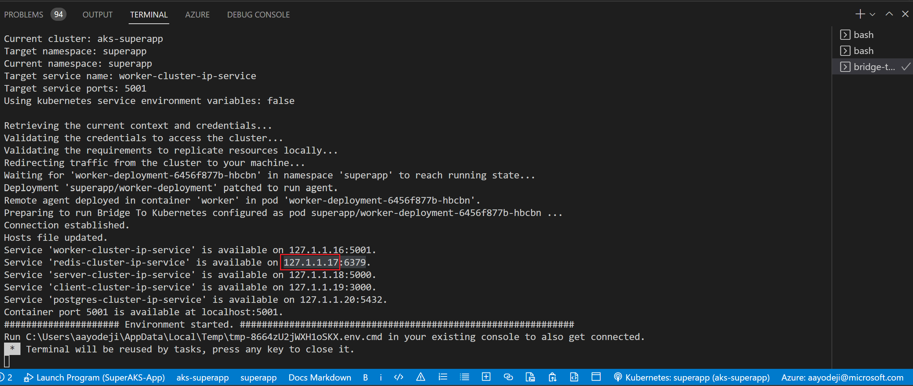
1. You can open the ./fib-calculator/worker/index.js file, put a break point on the last line of the script and click on the debug tab to the left
1. Click on the green Play button next to "Launch Program" at the top left side of the screen to begin debugging
1. Click on the "Continue" button of the debugger to complete the run
1. If you head to the "DEBUG CONSOLE" tab and see an error about connecting to redis, it means you are having service discovery issues.
1. OPTIONAL To fix redis connection error: In your ./fib-calculator/worker/index.js file, replace ${keys.redisHost} in the redis connection URL with the host address of the redis-cluster-ip-service noted earlier
    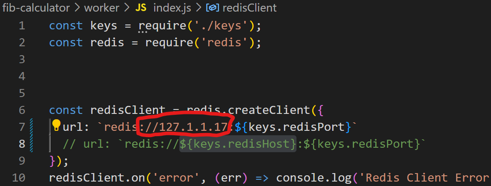
1. Run the debugger and try calculating the fibonacci number for 3 using the web front end on the browser and you will see that the result is not correct. We need to fix this bug.
    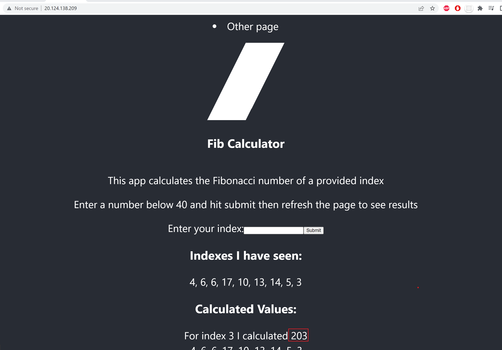
1. Head to the ./fib-calculator/worker/fib.js file and fix the fib function definition by removing the "+ 100" at the end of the second return statement then save it
1. Head back to the index file and run the debugger again 
1. Try calculating the fibonacci number for 3 again and you will see that the result is now correct. Try this for other values to be sure.
    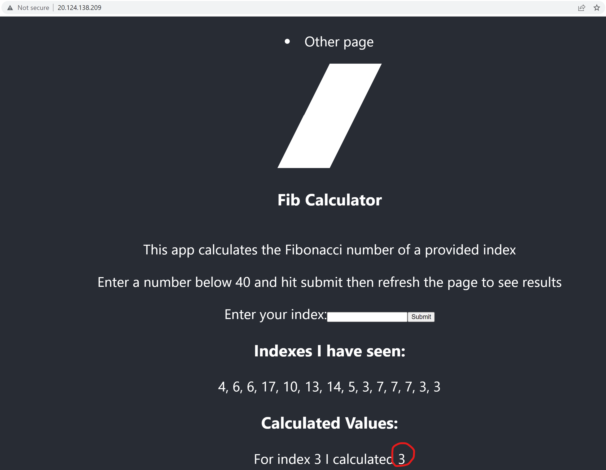
1. You can stop the debugger. Once you are satisfied with the changes, you can disconnect from bridge to kubernetes by clicking on the Kubernetes status bar menu and clicking on "Disconnect current session". You can then head to your Terminal tab and hit any key to close the connection. You might have to delete the current worker deployment and redeploy it again to restore connection to the worker pod running on AKS.
    ```bash
    kubectl delete deployment worker-deployment
    kubectl apply -f worker-deployment.yaml
    ```
1. You can now push your changes to GitHub 
    ```bash
    git add .
    git commit -m "fix fib calculation bug and update manifest files"
    git push origin main
    ```

## Deploy Updated Code using GitHub Action Workflow and the AKS Automated Deployment Feature
Now that we have pushed our changes to GitHub, you can follow the instructions in [this section of the demo repo](https://github.com/sabbour/contoso-names#create-a-github-actions-workflow) to use the "Automated Deployment" feature on AKS.

Please note that this is a preview feature that currently has two bugs which you can easily fix to deploy your changes. You can follow the steps below **after** following the instructions above to deploy your workflow which will fail.

The first one is because DevHub hasn't been updated to use Kubelogin. Add:
```yml
- name: Set up kubelogin for non-interactive login
  uses: azure/use-kubelogin@v1
  with:
     kubelogin-version: 'v0.0.24'
```
to the generated workflow in .github/workflows folder **right before aks-set-context**. 
You will also need to add the following to AKS set context (under with):
```yml
    admin: 'false'
    use-kubelogin: 'true'
```
Your pipeline file should look similar to the picture below:
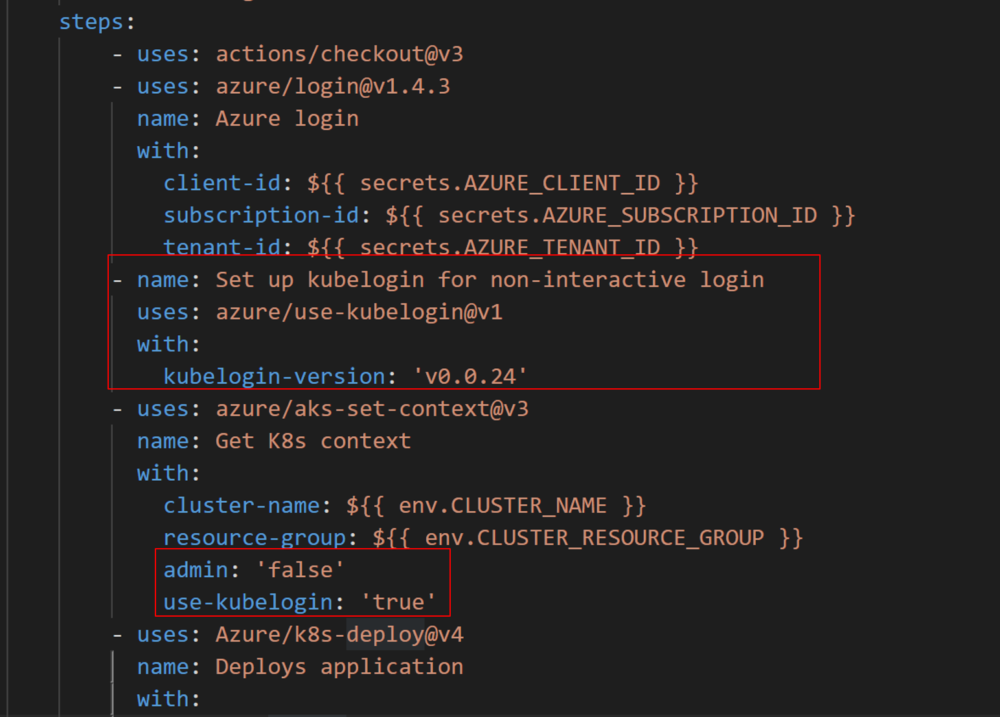

The second bug only occurs in AKS clusters which use RBAC for authorization (which is the case in the cluster are using in this workshop). It occurs because the OIDC issuer which provides an identity to the GitHub deployment runner isnt providing sufficient permission to that identity. 
1. You will need to head to Azure portal and find the AKS cluster. 
1. Click on "Access Control (IAM)" on the left blade and then click on the "Role Assignments" tab at the top of the "Access Control (IAM)" window. If you scroll down you will see that the github workflow identity only has "Contributor" access to the cluster. Contributor access doesn't permit the runner to deploy to AKS for RBAC clusters. It will need to be granted "Azure Kubernetes Service RBAC Cluster Admin" access. 
1. Click on "Add" at the top left side of the screen then click on "Add role assignment". 
1. For role, search for and select "Azure Kubernetes Service RBAC Cluster Admin" then click "Next". 
1. Click "+ Select members" while User, group, or service principal radio option is selected. Search for "workflowapp" and pick the one that was provided contributor access to your cluster. You might want to choose all the workflowapp available to be sure for demo purposes. 
    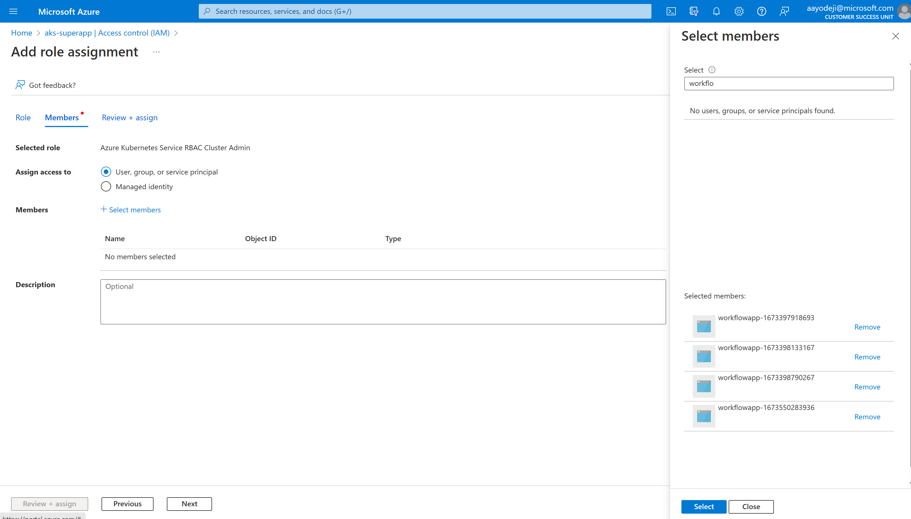
1. Click "Select" then click "Review + assign"
1. Click "Review + assign" again and wait for the assignment to be complete
1. Head back to your GH repository and rerun the GitHub Action which you can find in the "Actions" tab in GitHub. Select the failed run then click on "Re-run jobs" on the top right corner of the screen then click on "Re-run all jobs"
1. Watch it pass this time. After the deployment has completed, head back to your browser and try running a calculation again by entering a number and hitting submit. You will that the result is now calculated correctly on the live site


## Other AKS features that aid developer productivity
As you have seen, AKS has lots of features that help with developer productivity by automating steps for you. These can help you get to production very quickly. There are many tools that were not covered in this workshop including the following:
1. [Open service mesh](https://learn.microsoft.com/en-us/azure/aks/open-service-mesh-deploy-addon-az-cli) extension for AKS for workload security by helping limiting pod traffic allowing pods only talk to other pods they need to reducing attach surface
1. [Dapr](https://learn.microsoft.com/en-us/azure/aks/dapr) extension for AKS, a portable event-driven runtime that simplifies building resilient, stateless, and stateful applications by abstracting away code required connect microservices to datastores, amongst other things
1. [Flux GitOps](https://learn.microsoft.com/en-us/azure/azure-arc/kubernetes/conceptual-gitops-flux2) extension which makes it easy to deploy applications to your cluster using GitOps
1. We talked about autoscaling your app using horizontal pod autoscaler. With [KEDA](https://learn.microsoft.com/en-us/azure/aks/keda-about) addon for AKS, you can auto scale using other metrics and events

What AKS features for developer productivity would you like me to showcase next? Let me know by creating issues or commenting on existing ones.
